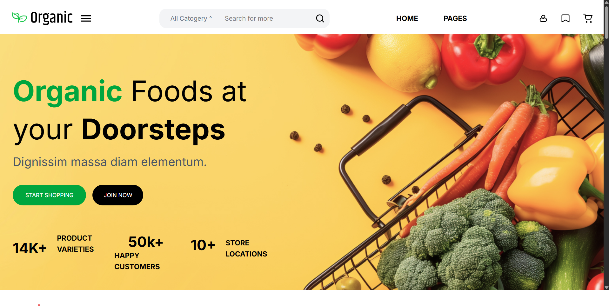

# Tail-Ali Food Temp 🍔

This is a fully responsive food website template built using **Tailwind CSS**. It displays food item cards dynamically using **JavaScript**. This project is a clone made for learning purposes and showcases modern layout techniques with clean, responsive design.

## 🚀 Features

- 🔹 Fully responsive layout using Tailwind CSS
- 🔹 Food cards rendered dynamically with JavaScript
- 🔹 Mobile-first design approach
- 🔹 Organized file structure with reusable components
- 🔹 Easy to customize and extend

## 🗂️ Project Structure

tailwind-responsive-food-ui/
├── demo.png            # Template preview image  
├── index.html          # Main HTML file  
├── input.css           # Tailwind source file  
├── output.css          # Compiled Tailwind CSS file  
├── data.js             # Food data for cards  
├── script.js           # JavaScript to render cards dynamically  
├── package.json        # NPM configuration  
├── package-lock.json   # NPM lock file  
├── README.md           # Project documentation  
├── node_modules/       # Tailwind and other dependencies  
└── images/             # Image assets used in the site  


## 🛠️ Technologies Used

- HTML5
- Tailwind CSS (via CDN or build process)
- JavaScript (DOM manipulation, data handling)

## 📸 Screenshots

Here is a preview of the tailwind-responsive-food-ui:



## 🧠 How It Works

- Food data is stored in `data.js` as an array of objects.
- `script.js` reads this data and dynamically creates card elements.
- These cards are added to the page using JavaScript DOM methods.
- Tailwind CSS handles all styling and layout.

## 📱 Responsive Design

The template works perfectly on:

- 📱 Mobile phones
- 💻 Laptops & Desktops
- 📟 Tablets

## 🧪 Getting Started

1. Clone this repository:
   ```bash
   git clone https://github.com/your-username/tail-ali-food-temp.git
   ```
   
## 🙌 Author

- [Ansari Soman](https://github.com/Ansari-Soman)

---

Feel free to use this project for learning or personal use!